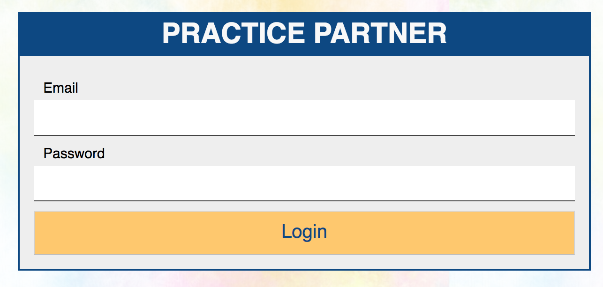
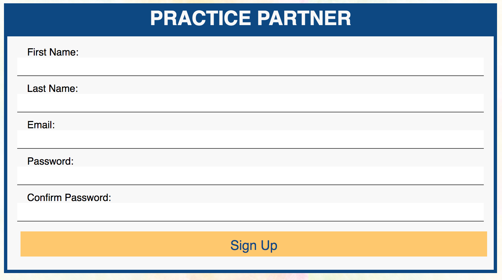
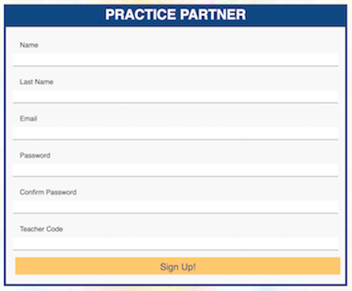
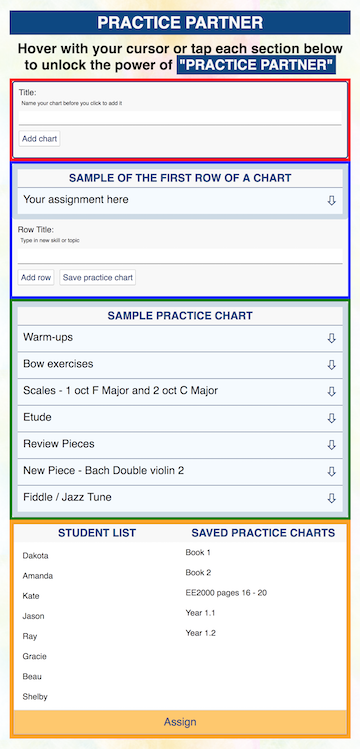
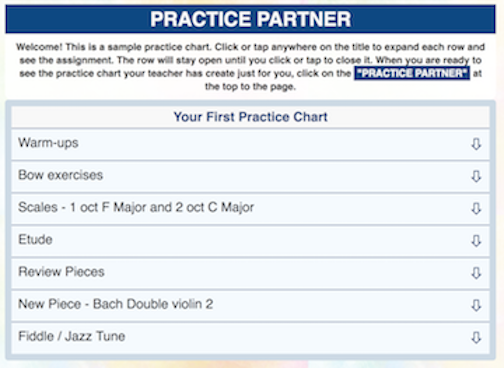

 
**PRACTICE PARTNER** - an app for music teachers and their students

Benjamin Franklin wrote, "in this world nothing can be said to be certain, except death and taxes". (1789 - Thanks for the uplifting thought, Ben ;-)  I have another. Getting students to practice their musical instrument is usually a struggle. They don't know what to practice or how to practice. So they end up playing for 30 minutes and call it practicing.  Once they are practicing, getting them to practice correctly is the next battle.  With **PRACTICE PARTNER**, you can create a practice chart with the skills on which to focus, the order of those skills, and the ability to explain the assignment all in one app. **PRACTICE PARTNER** assists teachers to create, save, and assign a practice chart to one student or an ensemble of 100 students.  Each student has their own practice chart to guide their practicing.  It is like having a **PRACTICE PARTNER** in every practice session!

A link to a deployed version
https://www.practicePartner-client.herokuapp.com  
https://git.heroku.com/cryptic-basin-90804.git  

Screenshots of your app

**LogIn**
Simple log-in for both teachers and students.
 
 
**SignUp for Teachers**
Teachers and students have a different sign-up form. When teachers sign-up, they will be given a "Teacher code".  That code is used once by each student when they are signing-up.
 

**SignUp for Students**
Students will sign-up and, at that time, input the "Teacher code" given. That code will connect the teacher and that student.
 

**Get Started for Teachers**
Get Started page for teachers, all of the parts explained with drop down.
 

**Get Started for Students**
Get Started page allows students to interact with a sample practice chart.
 

A description of your tech stack

A brief description of where each of the key parts of the project live in your codebase